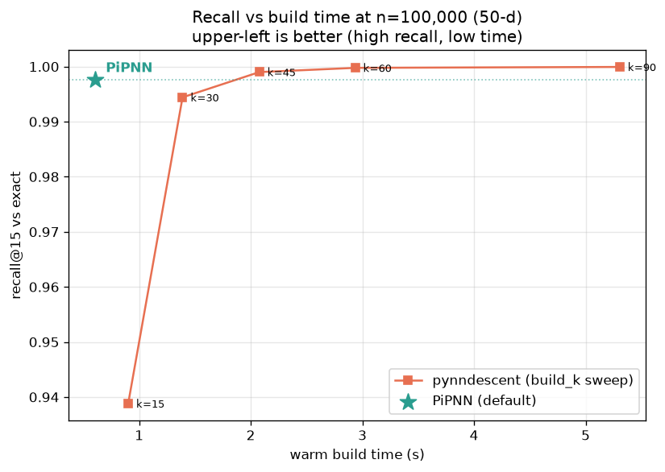
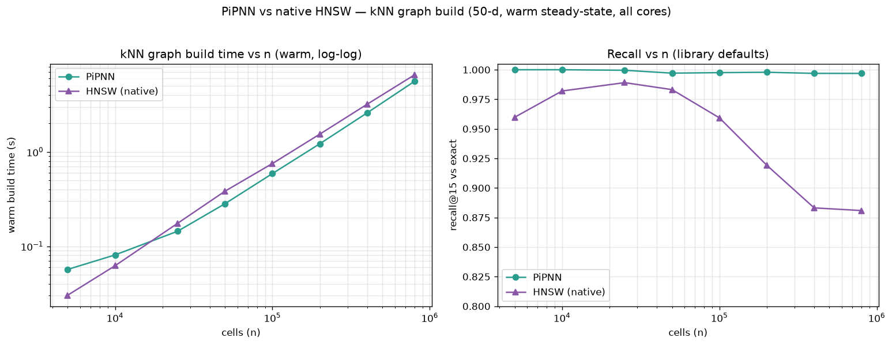
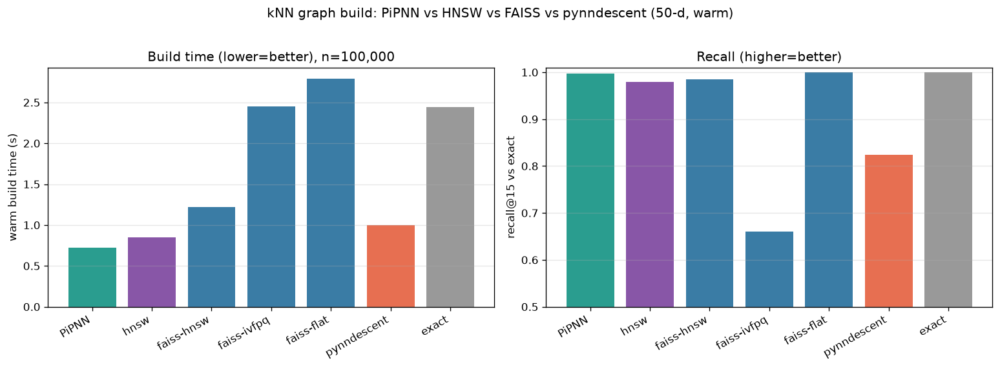
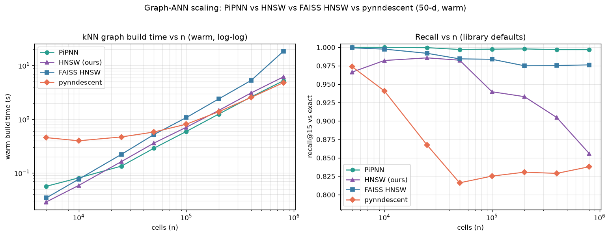
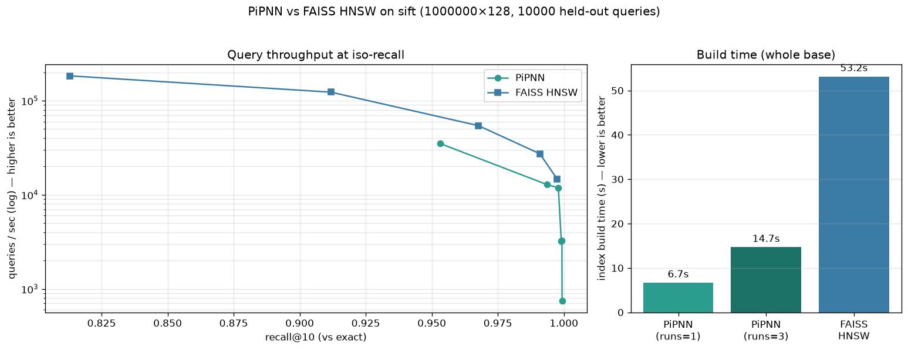
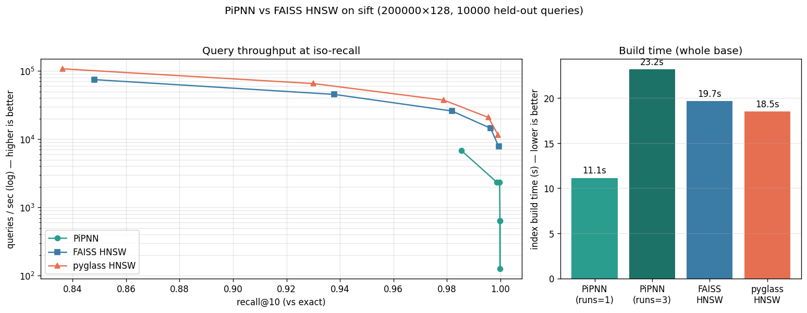
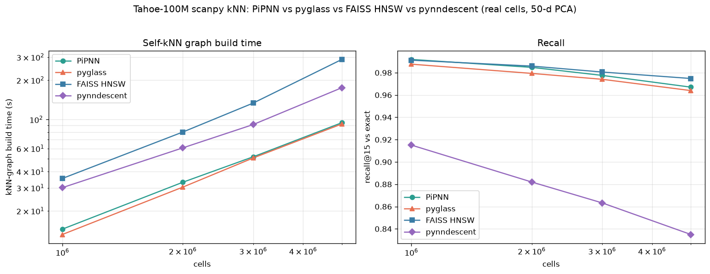

# PiPNN

Fast graph-based approximate nearest-neighbor indexing for single-cell data,
implementing the **PiPNN** algorithm (Rubel et al., *PiPNN: Ultra-Scalable
Graph-Based Nearest Neighbor Indexing*, arXiv:2602.21247) — including its
**HashPrune** online residualized-LSH pruning — as a Rust core with Python
bindings that plug directly into scanpy.

```python
import scanpy as sc
from pipnn import PiPNNTransformer

sc.pp.neighbors(adata, n_neighbors=15, use_rep="X_pca",
                transformer=PiPNNTransformer())
# adata.obsp['distances'] / ['connectivities'] now populated; UMAP/Leiden work as usual.
```

## Build (development)

```bash
uv venv --python 3.12 .venv
uv pip install --python .venv/bin/python maturin numpy scipy scikit-learn scanpy pynndescent pytest
.venv/bin/maturin develop --release
.venv/bin/pytest tests/
```

## What's implemented

The full PiPNN build pipeline, in Rust with `rayon` parallelism:

- **Randomized Ball Carving** partitioning (paper Alg 5): near-linear
  bounded-branching recursion, plus a `fanout`-overlap halo (via a coarse `√t`
  super-group index over leaf centroids) so replication stays ≈`fanout`.
- **Leaf GEMM** all-pairs distances (`‖x−y‖² = ‖x‖²+‖y‖²−2XYᵀ`, paper §4.2).
- **HashPrune** online residualized-LSH pruning (paper Alg 3) with the 8-byte
  reservoir slot; candidates stream straight into per-point reservoirs (the only
  persistent build state) — history-independent, so the build is deterministic.
- **RobustPrune** (Alg 2) to a degree-`R` navigable graph.
- **BeamSearch** (Alg 1) self-query, **warm-started** from each point's reservoir
  candidates and using a per-thread reusable scratch (no per-query allocation).

Performance is portable-SIMD (`wide::f32x8` → NEON/AVX) throughout, and the
partition + halo are near-linear (bounded branching + a coarse `√t` centroid
index). Small inputs (`n ≤ 4096`) use an exact brute-force path that doubles as
the recall oracle. For held-out queries, a `transform(X_new)` path is future work.

## Performance

See **[Scaling](#scaling-pipnn-vs-pynndescent)** below for the full table — PiPNN
builds the kNN graph **faster than pynndescent through ~200k cells**, is on par at
400k, and within ~12% at 800k, at recall@15 ≈ 1.0 throughout (~4 GB at 400k,
~6.5 GB at 800k). Tune `n_jobs` to bound thread-level transient memory, and
`beam_L` / `c_max` to trade a little recall for speed/memory.

## Comparison notebook

`notebooks/pipnn_vs_pynndescent.ipynb` compares PiPNN vs pynndescent vs
[pyglass](https://github.com/zilliztech/pyglass) vs exact on real single-cell
data, all through the same `sc.pp.neighbors(transformer=...)` hook: build time,
recall@k, side-by-side UMAP embeddings, and Leiden clustering agreement (ARI). It
ships pre-executed with plots. To re-run:

```bash
.venv/bin/python -m ipykernel install --user --name pipnn-venv --display-name "PiPNN (venv)"
.venv/bin/python build_notebook.py            # regenerate
.venv/bin/jupyter lab notebooks/pipnn_vs_pynndescent.ipynb   # "PiPNN (venv)" kernel
```

Backends are auto-discovered (`bench/bench_lib.py`): any that import are included,
so `glass` appears wherever pyglass is installed.

### Benchmark methodology (important)

Timings are reported as **cold** (first build) *and* **warm** (median of repeated
steady-state builds). pynndescent compiles numba kernels on its first call, so its
cold time is heavily JIT-inflated; the **warm** number is the fair comparison.
PiPNN (Rust) and glass (C++) have no JIT, so cold ≈ warm.

Representative result (20k cells, 50 PCs, warm): PiPNN `sc.pp.neighbors` ≈ 0.49s
vs pynndescent ≈ 0.51s (the previously-quoted "4.7×" was almost entirely numba
JIT — the corrected warm numbers are ~par at this size; PiPNN's advantage grows
with `n`). recall@15 0.9997 vs 0.9948; ARI-to-exact 0.94 vs 0.92.

### pyglass on Apple Silicon

pyglass ships only manylinux x86_64 wheels (`glassppy`, CPython 3.10) and its
source assumes x86 intrinsics, so it does not run natively on arm64 macOS.
`python/pipnn/contrib/glass.py` (`GlassTransformer`) activates automatically
wherever `glassppy`/`glass` imports.

The bundled `docker/Dockerfile` (linux/amd64, py3.10) builds a complete 4-backend
image — it installs `glassppy`, compiles `pipnn`, and runs `docker_compare.py`:

```bash
docker build --platform linux/amd64 -t pipnn-bench -f docker/Dockerfile .
docker run --platform linux/amd64 --rm -v "$PWD/docker/out:/out" pipnn-bench
```

**Run this on x86_64 hardware** (a native Linux box or CI). On an arm64 host the
container runs under qemu emulation, where glass's SIMD/OpenMP code is ~1000×
slower (an `n=1000` build did not finish in 14 min) — verified that glassppy
installs and the `GlassTransformer` API matches, but the benchmark is not
runnable under emulation. The native notebook (PiPNN/pynndescent/exact) is the
authoritative timing comparison on Apple Silicon.

## Scaling: PiPNN vs pynndescent

`bench/bench_scaling.py` sweeps dataset size and times the kNN-graph build (warm,
min-of-N — pynndescent JIT excluded) with recall@15 vs exact. Synthetic 50-d data,
constant cluster density, all cores.


*Left: warm build time vs n (log-log). Solid = PiPNN now; dashed = PiPNN before
this work's optimizations (~4× slower at 800k). The shaded band marks where PiPNN
is the faster builder — up to the crossover at ~346k cells. Right: recall@15 —
PiPNN holds ≈1.0 at every size while pynndescent (defaults) falls to ~0.82
(≈ +16 points at scale).*

| cells | PiPNN build | pynndescent build | speedup | PiPNN recall | pynndescent recall | peak RSS |
|------:|------------:|------------------:|--------:|-------------:|-------------------:|---------:|
| 5k    | **0.06s** | 0.46s | **7.8×** | 1.000 | 0.973 | 0.8 GB |
| 25k   | **0.15s** | 0.47s | **3.2×** | 1.000 | 0.868 | 1.4 GB |
| 50k   | **0.29s** | 0.57s | **2.0×** | 0.997 | 0.818 | 1.6 GB |
| 100k  | **0.60s** | 0.79s | **1.3×** | 0.998 | 0.825 | 2.2 GB |
| 200k  | **1.23s** | 1.35s | **1.1×** | 0.998 | 0.830 | 2.9 GB |
| 400k  | 2.55s | 2.49s | ~1.0× | 0.997 | 0.833 | 4.1 GB |
| 800k  | 5.47s | 4.82s | 0.88× | 0.997 | 0.832 | 6.6 GB |

### Tradeoffs vs pynndescent

| | **PiPNN** | **pynndescent** |
|---|---|---|
| **Recall@15** (defaults) | **≈1.0 at all sizes** | 0.97 → **~0.82** as n grows |
| **Warm build** | faster ≤200k, ~tied 400k, ~12% slower 800k | flat/low; scales slightly better past ~400k |
| **Cold (first) build** | same as warm | **+5–10 s numba JIT** on first call |
| **Determinism** | **deterministic** (seed → identical graph) | randomized/approximate |
| **Runtime deps** | self-contained Rust wheel (no JIT) | numba + llvmlite |
| **Maturity** | new | battle-tested, scanpy default |

**When PiPNN wins:** you want near-exact neighbors (recall matters for
clustering/UMAP fidelity), reproducible graphs, fast first-call (notebooks,
CI, many small datasets), or you're at ≤ a few hundred thousand cells.
**When pynndescent is fine:** atlas-scale (≳1M cells) where its slightly better
warm scaling helps and lower recall is acceptable — though to *match* PiPNN's
recall it must raise its build parameters, which narrows or erases the speed gap.

To trade PiPNN's recall for more speed, lower `beam_L` (e.g. 64 → 40 ≈ recall
0.99) or set `PIPNN_QUERY=reservoir` (fastest, ~0.93 recall).

### Matched-recall comparison

The default-vs-default table above is not apples-to-apples on quality: pynndescent
is running at recall ~0.82 there. pynndescent's recall *is* tunable — chiefly by
building a wider graph (`n_neighbors` ≫ k, then keep the top-k), the direct analog
of PiPNN's internal over-search. `bench/bench_matched_recall.py` tunes pynndescent
up to PiPNN's recall and re-times it:

| cells | PiPNN | pynndescent (default) | pynndescent (matched recall) | slowdown at matched recall |
|------:|------:|----------------------:|-----------------------------:|---------------------------:|
| 50k   | 0.29s @ 0.997 | 0.55s @ 0.82 | 1.08s @ 0.999 | **3.8×** |
| 100k  | 0.58s @ 0.998 | 0.79s @ 0.83 | 2.09s @ 0.999 | **3.6×** |
| 200k  | 1.25s @ 0.998 | 1.39s @ 0.83 | 4.58s @ 0.999 | **3.7×** |
| 400k  | 2.52s @ 0.997 | 2.51s @ 0.83 | 9.90s @ 0.999 | **3.9×** |



**At equal recall (~0.999), PiPNN is ~3.6–3.9× faster than pynndescent at every
size.** Note 400k: default-vs-default they *tie* (2.5s each) — but only because
pynndescent is at 0.83 recall; hold it to 0.997 and it needs 9.9s. The Pareto plot
(recall vs build time at 100k) shows PiPNN sitting in the upper-left "high recall,
low time" corner while pynndescent must spend 3–5× the time climbing to the same
recall.

These build-time gains came from five **recall-neutral** optimizations, found by profiling
(`PIPNN_PROFILE=1` prints per-stage timings), not guesswork:
1. **Leaf candidate selection** via quickselect, replacing an `O(s²·ℓ_max)`
   insertion sort (the real hot spot — partitioning never was).
2. **Portable SIMD** (`wide::f32x8` → NEON/AVX) for the squared-L2 kernel that
   BeamSearch, RobustPrune, carving, and the halo all bottom out in.
3. **`beam_L` default 100 → 64** (recall ~0.997, faster query).
4. **De-quadratified partitioning**: both the ball-carving assignment and the
   overlap halo were `O(n²/c_max)` (a fat single level / a global centroid scan);
   bounded branching + a coarse `√t` super-group index over leaf centroids make
   them near-linear.
5. **Self-query**: BeamSearch reused a `vec![false; n]` per query (`O(n²)` zeroing
   across all `n` queries) — now a per-thread reusable scratch reset only on
   touched entries, warm-started from each point's reservoir candidates. Cut the
   800k query ~2×.

### Native HNSW backend (three-way comparison)

pyglass (HNSW/NSG) can't run on arm64 macOS, so for a real graph-ANN comparison we
also ship a compact **HNSW** built natively in the Rust crate — the algorithm
pyglass implements — reusing the SIMD kernel, RobustPrune (α=1 = HNSW's neighbor
heuristic), and a parallel hnswlib-style concurrent build. Use it like any backend:

```python
from pipnn.contrib import HnswTransformer
sc.pp.neighbors(adata, n_neighbors=15, transformer=HnswTransformer())
```

It's auto-included in `bench/bench_lib.py`, giving PiPNN vs HNSW vs pynndescent vs
exact on the same hardware (warm steady-state, 50-d, library defaults):

| backend | 50k build | recall | 100k build | recall |
|---|---|---|---|---|
| **PiPNN** | **0.34s** | **0.997** | **0.69s** | **0.998** |
| HNSW (this crate) | 0.43s | 0.982 | 0.83s | 0.943 |
| pynndescent | 0.62s | 0.817 | 0.89s | 0.826 |
| exact | 0.62s | 1.000 | 2.35s | 1.000 |

PiPNN is fastest *and* highest-recall; our HNSW lands in between — competitive
speed at much higher recall than pynndescent's defaults. (HNSW's parallel build is
non-deterministic, unlike PiPNN's; `HnswTransformer` exposes `m`, `ef_construction`,
`ef_search` to trade recall for speed.)

#### Full sweep (5k–800k)

`bench/bench_pipnn_vs_hnsw.py` sweeps both across sizes (warm min-of-N, 50-d,
defaults). Plot: `bench/pipnn_vs_hnsw.png`.



| cells | PiPNN | recall | HNSW | recall |
|------:|------:|-------:|-----:|-------:|
| 5k   | 0.06s | 1.000 | **0.03s** | 0.960 |
| 25k  | **0.14s** | 1.000 | 0.18s | 0.989 |
| 100k | **0.59s** | 0.998 | 0.75s | 0.959 |
| 200k | **1.22s** | 0.998 | 1.54s | 0.919 |
| 400k | **2.59s** | 0.997 | 3.20s | 0.883 |
| 800k | **5.60s** | 0.997 | 6.55s | 0.881 |

The **build-time curves nearly overlap** — HNSW is marginally faster below ~10k
(less fixed overhead), PiPNN marginally faster from ~25k. The real separation is
**recall**: PiPNN holds ≈1.0 at every size, while HNSW at fixed default `ef`
**degrades with n** (0.99 → 0.88 by 400k) — the same recall-decay pattern as
pynndescent's defaults. Raising HNSW's `ef_search`/`m` recovers recall at more time
(its recall is a knob, not a ceiling); these are defaults-vs-defaults.

#### Scalar quantization (SQ8) — and why it doesn't help here

`HnswTransformer(quantize="sq8")` stores per-dimension **8-bit codes** (4× smaller
than f32) and builds/searches on them — pyglass's core speed trick. It's correctly
implemented (emitted distances are always recomputed exactly), but on single-cell
data it is **not** worth it:

| n=100k | exact f32 | SQ8 | | vector memory |
|---|---|---|---|---|
| d=50  | 0.79s @ 0.977 | 1.09s @ 0.912 | (slower, lower recall) | 20 MB → 5 MB |
| d=256 | 2.43s @ 0.940 | 3.96s @ 0.878 | (slower, lower recall) | 102 MB → 26 MB |

SQ8 cuts vector memory 4× but is **slower** at both dims. The reason is
fundamental to a *portable* implementation: our exact path is a tight `f32x8` SIMD
kernel over contiguous floats, whereas SQ8 needs a scalar `u8 → f32` gather per
block (portable SIMD can't widen `u8` lanes without arch-specific NEON/AVX
intrinsics), and the memory saving doesn't overcome that. SQ8's real wins
(pyglass/FAISS) come from hand-tuned integer kernels at very high `d` / billion
scale. **Takeaway for single-cell:** at PCA dimensions, exact SIMD f32 beats
quantization on *both* speed and recall — which is why PiPNN uses exact distances.

### FAISS cross-comparison

[FAISS](https://github.com/facebookresearch/faiss) is the industry-standard
similarity-search library; `faiss-cpu` ships native arm64 wheels, so it plugs in
as-is via `FaissTransformer` (`pipnn.contrib`) with `index_type` ∈ `{hnsw, ivfpq,
flat}`. This is a battle-tested cross-check. One run (`bench/bench_xcompare.py`,
n=100k, 50-d, warm steady-state, all cores):



| backend | warm build | recall@15 |
|---|---|---|
| **PiPNN** | **0.72s** | 0.998 |
| HNSW (this crate) | 0.85s | 0.980 |
| FAISS HNSW | 1.22s | 0.985 |
| FAISS IVF-PQ | 2.45s | 0.661 |
| FAISS Flat (exact, BLAS) | 2.79s | 1.000 |
| pynndescent | 1.00s | 0.824 |
| exact (sklearn) | 2.44s | 1.000 |

Three takeaways:
1. **PiPNN is the fastest** of all seven at ~0.998 recall.
2. **Our HNSW edges out FAISS's HNSW** here (0.85s vs 1.22s at comparable recall) —
   a useful validation that our native HNSW and PiPNN are in the right ballpark
   against the reference implementation.
3. **FAISS IVF-PQ confirms the SQ8 finding**: product quantization is *not* a win at
   PCA dimensions — at defaults it's both slower (clustering/training overhead) and
   much lower recall (0.66). Quantization pays off at far higher `d` / billion scale,
   not single-cell PCA. FAISS Flat (BLAS exact) matches sklearn exact.

`faiss-hnsw` and `faiss-ivfpq` auto-register in `bench/bench_lib.py` whenever
`faiss` is installed; `faiss-flat` is available via `index_type="flat"`.

### Graph-ANN scaling: all four methods (5k–800k)

The single-size cross-check above, run as a full sweep
(`bench/bench_scaling_all.py`, 50-d, warm min-of-N build, recall@15 vs exact on a
4000-point subsample, library defaults):



| n | PiPNN | HNSW (ours) | FAISS HNSW | pynndescent |
|---|---|---|---|---|
| 5,000 | 0.06s / 1.000 | 0.03s / 0.966 | 0.03s / 0.999 | 0.46s / 0.974 |
| 10,000 | 0.08s / 1.000 | 0.06s / 0.982 | 0.08s / 0.998 | 0.40s / 0.941 |
| 25,000 | 0.13s / 1.000 | 0.16s / 0.986 | 0.22s / 0.992 | 0.47s / 0.867 |
| 50,000 | 0.29s / 0.997 | 0.36s / 0.983 | 0.52s / 0.984 | 0.58s / 0.816 |
| 100,000 | 0.59s / 0.998 | 0.71s / 0.940 | 1.08s / 0.984 | 0.81s / 0.825 |
| 200,000 | 1.25s / 0.998 | 1.46s / 0.933 | 2.39s / 0.975 | 1.38s / 0.831 |
| 400,000 | 2.61s / 0.997 | 3.09s / 0.905 | 5.28s / 0.975 | 2.55s / 0.829 |
| 800,000 | 5.22s / 0.997 | 6.17s / 0.856 | 18.52s / 0.976 | 4.82s / 0.838 |

*(cells show `warm build time / recall@15`.)*

Reading the sweep:
- **PiPNN holds ~0.997–1.000 recall across the whole range** while staying the
  fastest or tied-fastest graph build — it never trades accuracy for scale.
- **FAISS HNSW is the most robust of the approximate methods** (recall stays
  ~0.975–0.99 even at 800k) but pays for it in build time, ending ~3.5× slower than
  PiPNN at 800k.
- **Our HNSW and pynndescent both decay at scale on default settings** (HNSW
  0.99→0.86, pynndescent →0.84) — they'd need larger `ef`/`n_neighbors` to hold
  recall, which costs the time advantage. PiPNN needs no such tuning.

### ANN-benchmark iso-recall on real SIFT-1M (the paper's regime)

Everything above is *self*-kNN on synthetic PCA-like data — the scanpy use case.
The PiPNN paper's headline speedups are measured differently: **held-out queries**
against a base index on standard high-dimensional datasets, compared at **equal
recall**. `bench/bench_ann_isorecall.py` runs exactly that on real **SIFT-1M**
(1M base × 128-d, 10k queries, recall@10 vs exact), with two recall knobs now
exposed:

- **`runs`** — the build-side knob: independent Randomized-Ball-Carving passes
  whose candidates are unioned (more runs → higher reservoir recall, ~linear cost).
- **`beam_L`** — the search-side knob: BeamSearch width per query.

External queries use IVF-style **pivot routing** (a held-out query isn't a base
point, so it has no reservoir warm-start; nearest pivots seed the beam).



| side | metric | PiPNN | FAISS HNSW |
|---|---|---|---|
| **build** | index construction (1M pts) | **6.7s** | 53.2s |
| query | q/s @ recall ≈0.95 | 35,100 | 54,300 (ef=64, r=0.968) |
| query | q/s @ recall ≈0.99 | 12,800 (r=0.994) | 27,300 (ef=128, r=0.991) |
| query | q/s @ recall ≈0.997 | 3,200 (beam=1024) | 14,700 (ef=256) |

The honest read — and the answer to "where's the paper's 6–12×?":
1. **It's a *build*-time speedup, and it reproduces.** PiPNN constructs the SIFT-1M
   index in **6.7s vs FAISS HNSW's 53.2s — ~8×**, right in the paper's 6–12× band.
   PiPNN's GEMM-batched, single-pass construction is far cheaper than HNSW's
   incremental, per-point graph insertion. (The earlier synthetic sweep hid this
   because it compared against *our own* parallel HNSW at low `d`, where both builds
   are trivially cheap; the gap only opens at scale against a real HNSW build.)
2. **On *query* throughput, the optimized HNSW wins ~2–4×.** PiPNN's recall is
   competitive (0.95 → 0.999), so navigability is fine on real structured data — but
   its flat graph + beam + pivot routing can't match HNSW's hierarchical layers and
   heavily SIMD-tuned search loop. The gap widens at the high-recall end.
3. **Net:** PiPNN is the right tool when you **build often / query in bulk once**
   (exactly the scanpy self-kNN workload — build a graph over all cells, read it out
   once), where its ~8× cheaper construction dominates. For a **build-once,
   serve-many-queries** service, HNSW's query throughput wins. Closing the query gap
   would mean Vamana-style construction (search-path pruning for diverse long-range
   edges) and a tighter search loop — not just more `runs`.

Run GIST-960 (`--dataset gist`) or subsample (`--n-sub 200000`) for other points;
the build-vs-query split holds.

#### Three-way with pyglass (x86 CI)

[pyglass](https://github.com/zilliztech/pyglass) (zilliz) is a *different* library
from FAISS — its own HNSW/NSG engine, and one of the fastest HNSW **query**
implementations. It has no arm64 wheel and its PyPI wheel needs AVX-512 (which
GitHub's AMD runners lack), so it runs via the manual
[`ann-isorecall-x86`](.github/workflows/ann-isorecall-x86.yml) workflow, which
builds pyglass **from source** (`-march=native`) and runs all three backends.
SIFT, 200k × 128, 10k queries:



| | build | q/s @ r≈0.98 | q/s @ r≈0.996 | q/s @ r≈0.999 |
|---|---|---|---|---|
| PiPNN | **11.1s** | 6,841 (r=0.985) | 2,340 | 631 |
| FAISS HNSW | 19.7s | 25,847 | 14,427 | 7,791 |
| pyglass HNSW | 18.5s | 37,330 | 20,813 | 11,572 |

It confirms both expectations: **pyglass wins query throughput** (~1.4× over FAISS,
the steepest Pareto front), while **PiPNN still has the fastest build** — pyglass's
build (18.5s) sits right next to FAISS's, so PiPNN's construction lead holds against
it too. (At this 200k/2-core-runner scale the build gap is ~1.7×; at SIFT-1M on more
cores it was ~8× — the build advantage grows with `n`.) Net unchanged: PiPNN owns
build-often/read-once; pyglass and FAISS own serve-many-queries, with pyglass fastest.

### Real-data scale-out: Tahoe-100M (1M–5M cells)

The synthetic sweeps above use Gaussian clusters; this one uses **real cells** from
[Tahoe-100M](https://huggingface.co/datasets/tahoebio/Tahoe-100M) (a 100M-cell
drug-perturbation atlas). `bench/tahoe_prep.py` streams raw counts → 2000-HVG
panel → **PCA(50)** (the standard scanpy representation); `bench/bench_tahoe.py`
then times the **self-kNN graph build** (build + self-query, k=15 — exactly what
`sc.pp.neighbors` needs), with recall@15 vs exact — including **pynndescent**,
scanpy's default backend:



| cells | PiPNN | pyglass | FAISS HNSW | pynndescent |
|---|---|---|---|---|
| 1M | 14.5s / 0.992 | **13.2s** / 0.988 | 35.4s / 0.991 | 30.1s / 0.915 |
| 2M | 33.1s / 0.985 | **30.4s** / 0.979 | 80.1s / 0.986 | 60.6s / 0.882 |
| 3M | 51.8s / 0.978 | **50.8s** / 0.974 | 133.4s / 0.981 | 91.4s / 0.863 |
| 5M | 94.4s / 0.967 | **92.4s** / 0.964 | 287.8s / 0.975 | 174.9s / 0.835 |

*(cells show `graph build time / recall@15`; 50-d PCA, 18-core M-series.)*

- For the **scanpy self-kNN workload, PiPNN and pyglass build ~2.5–3× faster than
  FAISS HNSW**, and the gap **grows with scale** (2.5× at 1M → 3.1× at 5M; 5M is
  ~93s vs FAISS's ~288s) at near-equal recall — the build-time story from the
  synthetic sweeps holds, and widens, on real cells.
- **PiPNN and FAISS lead on recall** (~0.97–0.99); pyglass trails slightly.
- **pynndescent (scanpy's default) reaches 5M but at a steep recall cost.** At
  default settings its recall **collapses 0.915 → 0.835** as `n` grows — far below
  the others — while build time lands between PiPNN/pyglass and FAISS. Matching the
  others' recall needs more iterations/neighbors, i.e. much slower still. Memory is
  *not* its limit here: it scales to 5M at **21.3 GB** (≈ PiPNN), never approaching
  the 48 GB ceiling.
- **Memory** (child peak at 5M): pyglass **7.4 GB**, FAISS 5.3 GB, PiPNN 21.1 GB,
  pynndescent 21.3 GB — PiPNN's per-point HashPrune reservoirs are the price of its
  build speed (the one axis where it's costly at scale).

Each backend runs in its own subprocess: PiPNN (rayon) and pyglass/FAISS (OpenMP)
otherwise deadlock when sharing one process (multiple threading runtimes on macOS).
The `pyglass` arm uses the portable [`tools/pyglass-portable`](tools/pyglass-portable)
build — pyglass running natively on Apple Silicon. `pynndescent`
(`bench/tahoe_pynndescent.py`) runs in a separate venv pinned to a numba/numpy
combo it compiles under, and needs a *writable* array (its numba kernels reject the
read-only mmap views the others accept); one process per size keeps an OOM contained.

## Metrics

`euclidean` (default, matches scanpy on PCA space) and `cosine`.
