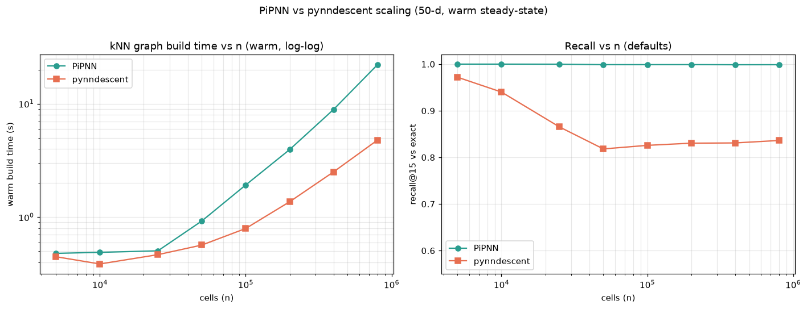

# PiPNN

Fast graph-based approximate nearest-neighbor indexing for single-cell data,
implementing the **PiPNN** algorithm (Rubel et al., *PiPNN: Ultra-Scalable
Graph-Based Nearest Neighbor Indexing*, arXiv:2602.21247) — including its
**HashPrune** online residualized-LSH pruning — as a Rust core with Python
bindings that plug directly into scanpy.

```python
import scanpy as sc
from pipnn import PiPNNTransformer

sc.pp.neighbors(adata, n_neighbors=15, use_rep="X_pca",
                transformer=PiPNNTransformer())
# adata.obsp['distances'] / ['connectivities'] now populated; UMAP/Leiden work as usual.
```

## Build (development)

```bash
uv venv --python 3.12 .venv
uv pip install --python .venv/bin/python maturin numpy scipy scikit-learn scanpy pynndescent pytest
.venv/bin/maturin develop --release
.venv/bin/pytest tests/
```

## What's implemented

The full PiPNN build pipeline, in Rust with `rayon` parallelism:

- **Randomized Ball Carving** partitioning (paper Alg 5), as a two-stage
  disjoint-carve + bounded-halo scheme so total replication is ≈`fanout`
  (not `fanout^depth`).
- **Leaf GEMM** all-pairs distances (`‖x−y‖² = ‖x‖²+‖y‖²−2XYᵀ`, paper §4.2).
- **HashPrune** online residualized-LSH pruning (paper Alg 3) with the 8-byte
  reservoir slot; candidates stream straight into per-point reservoirs (the only
  persistent build state) — history-independent, so the build is deterministic.
- **RobustPrune** (Alg 2) to a degree-`R` navigable graph.
- **BeamSearch** (Alg 1) self-query, seeded at each point for robust self-kNN.

Small inputs (`n ≤ 4096`) use an exact brute-force path that doubles as the
recall oracle. For very large/held-out queries, a global navigable index +
held-out `transform(X_new)` is future work.

## Performance (50-d, M3-class laptop, 16 threads)

| n        | build+query | recall@15 | peak RSS |
|----------|-------------|-----------|----------|
| 100k     | ~1.8 s      | 0.9999    | ~0.4 GB* |
| 500k     | ~13 s       | 0.988     | ~2.0 GB* |

`*` PiPNN-only; benchmark-process peaks are higher because they also hold the
sklearn exact-NN ground truth. At 100k, PiPNN built **~2.7× faster than
pynndescent** (cold start) at equal-or-better recall.

### Scaling notes

Comfortable to ~1M cells (~4–5 GB). Beyond that, two known costs need the
Phase-8 optimizations: the halo step is `O(n²/c_max)`, and the per-leaf GEMM
transient grows with leaf size. Raise `c_max` / lower `fanout` to trade recall
for memory, or set `n_jobs` to bound thread-level transient memory.

## Comparison notebook

`notebooks/pipnn_vs_pynndescent.ipynb` compares PiPNN vs pynndescent vs
[pyglass](https://github.com/zilliztech/pyglass) vs exact on real single-cell
data, all through the same `sc.pp.neighbors(transformer=...)` hook: build time,
recall@k, side-by-side UMAP embeddings, and Leiden clustering agreement (ARI). It
ships pre-executed with plots. To re-run:

```bash
.venv/bin/python -m ipykernel install --user --name pipnn-venv --display-name "PiPNN (venv)"
.venv/bin/python build_notebook.py            # regenerate
.venv/bin/jupyter lab notebooks/pipnn_vs_pynndescent.ipynb   # "PiPNN (venv)" kernel
```

Backends are auto-discovered (`bench/bench_lib.py`): any that import are included,
so `glass` appears wherever pyglass is installed.

### Benchmark methodology (important)

Timings are reported as **cold** (first build) *and* **warm** (median of repeated
steady-state builds). pynndescent compiles numba kernels on its first call, so its
cold time is heavily JIT-inflated; the **warm** number is the fair comparison.
PiPNN (Rust) and glass (C++) have no JIT, so cold ≈ warm.

Representative result (20k cells, 50 PCs, warm): PiPNN `sc.pp.neighbors` ≈ 0.49s
vs pynndescent ≈ 0.51s (the previously-quoted "4.7×" was almost entirely numba
JIT — the corrected warm numbers are ~par at this size; PiPNN's advantage grows
with `n`). recall@15 0.9997 vs 0.9948; ARI-to-exact 0.94 vs 0.92.

### pyglass on Apple Silicon

pyglass ships only manylinux x86_64 wheels (`glassppy`, CPython 3.10) and its
source assumes x86 intrinsics, so it does not run natively on arm64 macOS.
`python/pipnn/contrib/glass.py` (`GlassTransformer`) activates automatically
wherever `glassppy`/`glass` imports.

The bundled `docker/Dockerfile` (linux/amd64, py3.10) builds a complete 4-backend
image — it installs `glassppy`, compiles `pipnn`, and runs `docker_compare.py`:

```bash
docker build --platform linux/amd64 -t pipnn-bench -f docker/Dockerfile .
docker run --platform linux/amd64 --rm -v "$PWD/docker/out:/out" pipnn-bench
```

**Run this on x86_64 hardware** (a native Linux box or CI). On an arm64 host the
container runs under qemu emulation, where glass's SIMD/OpenMP code is ~1000×
slower (an `n=1000` build did not finish in 14 min) — verified that glassppy
installs and the `GlassTransformer` API matches, but the benchmark is not
runnable under emulation. The native notebook (PiPNN/pynndescent/exact) is the
authoritative timing comparison on Apple Silicon.

## Scaling: PiPNN vs pynndescent

`bench/bench_scaling.py` sweeps dataset size and times the kNN-graph build (warm,
min-of-N — pynndescent JIT excluded) with recall@15 vs exact. Synthetic 50-d data,
constant cluster density, all cores. Plot: `bench/scaling.png`.



| cells | PiPNN build | pynndescent build | PiPNN recall | pynndescent recall | peak RSS |
|------:|------------:|------------------:|-------------:|-------------------:|---------:|
| 5k    | 0.48s | 0.45s | 1.000 | 0.972 | 0.9 GB |
| 25k   | 0.50s | 0.47s | 1.000 | 0.865 | 1.3 GB |
| 100k  | 1.92s | 0.79s | 0.999 | 0.826 | 2.1 GB |
| 200k  | 3.94s | 1.37s | 0.999 | 0.831 | 2.6 GB |
| 400k  | 8.89s | 2.50s | 0.999 | 0.831 | 4.0 GB |
| 800k  | 22.1s | 4.77s | 0.999 | 0.836 | 5.9 GB |

**Honest read:** the two are par up to ~25k, after which **pynndescent's build
scales better** (≈linear) and PiPNN's grows faster — the per-leaf halo is
`O(n²/c_max)`, which dominates the tail (this is the documented scaling limit).
So at warm steady-state pynndescent is the faster *builder* at scale. PiPNN's edge
is **accuracy**: it holds recall@15 ≈ 1.0 at every size, while pynndescent at its
defaults plateaus near 0.82–0.84. In short — PiPNN trades build speed for
near-exact, size-stable recall. Two levers change the trade: lower `beam_L`
(faster PiPNN, slightly lower recall), and fixing the halo to a hierarchical /
approximate nearest-leaf search would flatten PiPNN's curve (future work).

## Metrics

`euclidean` (default, matches scanpy on PCA space) and `cosine`.
